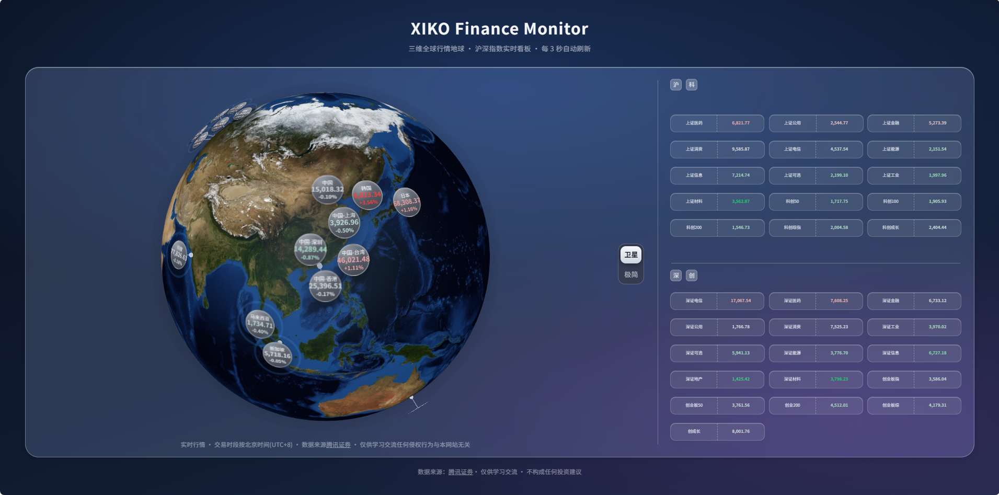

# XIKO Finance Monitor

<div align="center">

**三维全球行情地球 · 沪深指数实时看板**

[](LICENSE)
[](package.json)
[](https://react.dev/)
[](https://vite.dev/)
[](https://threejs.org/)
[](https://github.com/topojson/topojson-client)
[](https://github.com/xieiscoding/myweb_upload/pulls)
[](https://6coins.net)

> 🎉 欢迎访问 [6coins.net](https://6coins.net) 个人博客小站 —— XIKO Finance Monitor 正是这个小站中的一个页面。
> 本项目将其中的「三维全球行情地球 + 沪深指数实时看板」独立提取、开源，方便大家直接部署与二次开发。

</div>

---

## 📖 简介

XIKO Finance Monitor 是一个**纯前端、零后端依赖**的全球行情监控面板：

- **左侧三维地球**：基于 Three.js（WebGL + CSS3D 双层混合渲染）构建的可交互地球，24 个全球主要指数的圆形行情图标按经纬度贴附球面，随太阳直射经度自动自转，支持鼠标拖动、卫星 / 极简地图切换；
- **右侧沪深看板**：沪市 / 科创板、深市 / 创业板共 31 个 A 股指数，以「长条翻转卡片」实时呈现简称、数值、代码与涨跌幅，并自动按涨跌幅从高到低排序。

行情数据由**浏览器直连腾讯证券公开接口**获取并本地解析，不依赖任何后端服务、数据库或本地文件，部署到任意静态托管（GitHub Pages / Cloudflare Pages / Vercel / Nginx 等）即可运行。


## ✨ 功能特性

- 🗺️ **双图层三维地球**：WebGL 渲染地球纹理、大气辉光与引导线；CSS3D 渲染 HTML 指数图标，深度一致、遮挡正确；
- 🔄 **卫星 / 极简地图一键切换**：极简地图为程序化生成（深蓝海洋 + 国界 / 海岸线烘焙贴图）；
- ☀️ **太阳驱动自转**：每 5 分钟计算太阳直射经度，地球以「先加速再减速」动画自动转向太阳；无操作 10 秒后自动归位；
- 📍 **图标防重叠布局**：迭代松弛算法（最小间距 + 最大偏移角双约束，完全确定、无随机），偏移图标以细引导线连回地区锚点；
- 🫥 **智能遮挡与背面镜像**：图标转过球体边缘时显示"反面"，被地球遮挡时自动隐藏；
- 💡 **磨砂悬浮详情框**：悬停指数图标弹出毛玻璃详情（中文 / 英文名称、地区、更新时间、数值、涨跌幅），跟随鼠标；
- 🔴🟢 **红涨绿跌配色**：涨跌幅越大颜色越深（与右侧看板一致）；
- 🃏 **沪深翻转卡片**：正面「简称 + 数值」，悬停翻面显示「代码 + 涨跌幅」，按涨跌幅自动排序；
- ⏱️ **每 3 秒自动刷新**：交易时段判断按北京时间（UTC+8），欧洲指数时间含夏令时换算。

## 🖼️ 页面预览

> 截图位：可在此处替换为实际运行效果截图。

## ⚙️ 工作原理

### 1. 三维地球（`GlobeWidget.jsx` + `geo.js` + `sun.js`）

- 地球使用 `SphereGeometry` + 卫星贴图（`public/globe/earth-blue-marble.jpg`）或程序化生成的极简地图贴图；
- 指数图标以 CSS3D 对象（真实 DOM）挂在球面上方 1.07 倍半径处，与 WebGL 场景共享相机，因此两者旋转、遮挡完全同步；
- `geo.js` 负责：经纬度 → 球面坐标换算、图标防重叠迭代松弛、极简地图画布生成；
- `sun.js` 使用低精度 NOAA 太阳位置算法计算太阳直射经度，驱动地球自转。

### 2. 行情数据前端化（`financeRunner.js` / `indexRunner.js`）

- 浏览器直接请求 `https://qt.gtimg.cn/q=<code>`（腾讯行情公开接口，允许跨域）；
- 返回内容为 GBK 编码、`~` 分隔字段的文本，前端用 `TextDecoder('gbk')` 解码后按 A 股 / 港股 / 富时系 / gz 国际 / 美股五种格式解析；
- 交易时段表、时区换算表、指数元数据表全部内嵌在前端（等价于把原 Python 版 `getroughdata.py` + `tradetime.xlsx` 的逻辑移植到了浏览器）；
- 更新时间统一换算为北京时间（UTC+8），欧洲指数按 IANA 时区做夏令时感知换算。

### 3. 沪深看板（`IndexPanel.jsx`）

- 沪市 / 科创板、深市 / 创业板各一个半区，3 列卡片网格；
- 排序码按涨跌幅降序排列，附加码以普通卡片排在后面；数值与涨跌幅共用「红涨绿跌」配色。

## 🚀 开始部署

### 环境要求

- Node.js ≥ 18（建议 20+）
- npm / pnpm / yarn 任一包管理器

### 本地运行

```bash
# 1. 克隆或下载本项目，进入目录
cd XIKO-Finance-Monitor

# 2. 安装依赖
npm install

# 3. 启动开发服务器（默认 http://localhost:5173）
npm run dev
```

### 生产构建

```bash
npm run build        # 产物输出到 dist/
npm run preview      # 本地预览生产构建
```

### 发布到静态托管

把 `dist/` 目录部署到任意静态托管即可，例如：

```bash
# GitHub Pages / Cloudflare Pages / Vercel / Nginx 任选其一
# 构建命令：npm install && npm run build
# 发布目录：dist
```

## 📦 相关依赖

| 依赖 | 版本 | 用途 |
| --- | --- | --- |
| [react](https://react.dev/) | ^19.2.7 | UI 框架 |
| [react-dom](https://react.dev/) | ^19.2.7 | React DOM 渲染 |
| [three](https://threejs.org/) | ^0.185.1 | WebGL / CSS3D 三维渲染 |
| [topojson-client](https://github.com/topojson/topojson-client) | ^3.1.0 | 解析世界国家边界 TopoJSON |
| [vite](https://vite.dev/) | ^8.1.1 | 构建工具 |
| [@vitejs/plugin-react](https://github.com/vitejs/vite-plugin-react) | ^6.0.3 | React 编译插件 |

## 🗂 项目结构

```
XIKO-Finance-Monitor/
├─ public/
│  └─ globe/                  # 地球资源
│     ├─ earth-blue-marble.jpg    # 卫星模式地球贴图
│     └─ countries-110m.json      # 世界国家边界（极简地图用）
├─ src/
│  ├─ main.jsx                # 入口
│  ├─ App.jsx                 # 根组件
│  ├─ index.css               # 全局样式（深空渐变背景 + 淡入动画）
│  └─ FinanceMonitor/
│     ├─ FinanceMonitor.jsx   # 页面主组件（布局 + 3 秒轮询数据）
│     ├─ FinanceMonitor.css   # 页面样式（磨砂大面板 / 翻转卡片 / 悬浮框）
│     ├─ GlobeWidget.jsx      # 三维地球（WebGL + CSS3D）
│     ├─ IndexPanel.jsx       # 右侧沪深指数翻转卡片区
│     ├─ geo.js               # 经纬度换算、图标防重叠布局、极简地图生成
│     ├─ sun.js               # 太阳直射经度计算（NOAA 算法）
│     ├─ format.js            # 数值格式化 + 红涨绿跌配色
│     ├─ financeRunner.js     # 全球指数行情前端解析
│     └─ indexRunner.js       # A 股指数行情前端解析
├─ index.html
├─ package.json
├─ vite.config.js
└─ LICENSE
```

## 🔧 常用可调参数

集中在 `src/FinanceMonitor/GlobeWidget.jsx` 顶部常量区：

| 常量 | 默认值 | 说明 |
| --- | --- | --- |
| `GLOBE_RADIUS` | 100 | 地球半径（核心大小参数） |
| `MARKER_FLOAT` | 1.07 | 图标悬浮高度（相对半径比例） |
| `MARKER_SCALE` | 0.32 | CSS3D 图标缩放（px → 场景单位） |
| `MARKER_SIZE` | 42 | 图标元素边长 px（须与 `.fm-marker` 一致） |
| `MARKER_MIN_SEP` | 16 | 图标中心最小间距（防重叠） |
| `MARKER_MAX_OFFSET_DEG` | 13 | 图标相对地区锚点最大偏移角 |

右侧看板的指数列表在 `FinanceMonitor.jsx` 顶部的 `SH_SORTED_CODES` / `SZ_SORTED_CODES` 等常量中配置。

## 🤖 Vibe Coding 鸣谢

本项目采用 **Vibe Coding** 工作流，由 [Codex](https://openai.com/codex/)（OpenAI 的 AI 编程助手）在对话式开发中完成主要代码编写与迭代。

特别鸣谢以下大模型在本项目开发过程中提供的支持：

- **DeepSeek V4 Flash（0731）** —— 提供高效的代码生成与快速迭代建议；
- **Qwen3.8-Max** —— 提供架构设计、细节打磨与多轮调试辅助。

> 致敬所有让「想法 → 代码 → 上线」变得前所未有的简单的 AI 工具与开源生态。

## 📊 数据来源

- **行情数据**：腾讯证券公开行情接口（`https://qt.gtimg.cn/q=<code>`），数据最终版权归各交易所 / 腾讯证券所有，给企鹅跪了orz；
- **全球指数**：上证、深证、恒生、富时系、日经、韩综指、欧美主要指数等 24 个全球指数；
- **A 股指数**：沪市 / 科创板、深市 / 创业板共 31 个指数；
- **地图数据**：世界国家边界来自公开的 TopoJSON 数据集（`countries-110m`，来源为 Natural Earth / world-atlas）。

## ⚠️ 免责声明

- 本项目**仅供学习交流使用**，任何侵权行为与本项目无关；
- 行情数据来自第三方公开接口，可能存在延迟、缺失或错误，**不构成任何投资建议**；
- 使用本项目产生的任何直接或间接损失，作者与贡献者不承担责任；
- 本项目与腾讯公司及其证券业务**无任何关联或背书关系**。

## 📄 开源协议

本项目基于 [MIT License](LICENSE) 开源，欢迎自由使用、修改与分发，使用时请保留版权声明。

## ⭐ 支持

如果这个项目对你有帮助，欢迎点亮 Star ⭐，也欢迎提交 Issue 与 PR。

**欢迎访问 [6coins.net](https://6coins.net) 个人博客小站，了解更多金融工程相关内容！**
